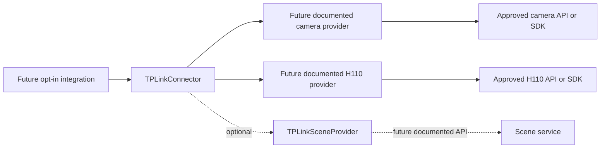
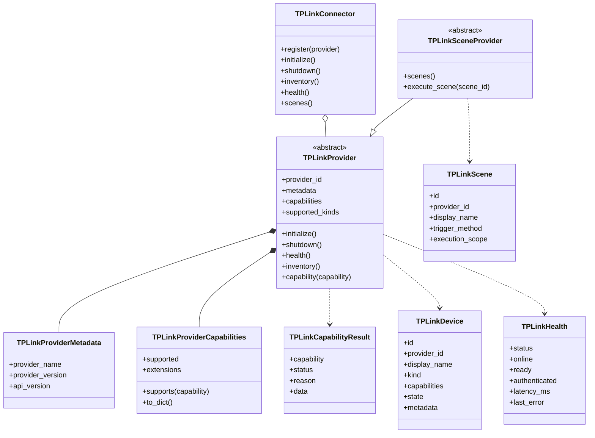

# TP-Link Connector Foundation

## Status and boundaries

EPIC 15 defines an inactive connector architecture. It does not register a
provider, create an application route, open a network connection, authenticate
to a cloud, execute a scene, inspect IR, or depend on an undocumented API.

Existing dashboard routes and provider behavior remain unchanged. Future
activation requires a separate reviewed integration module that explicitly
constructs a connector, registers providers, and maps its safe models to an
existing or approved API contract.

## Architecture



The connector is a composition boundary, not a transport. Each provider owns
its credentials, private vendor identifiers, client lifecycle, timeouts, and
documented protocol implementation. Those details never belong in connector
inventory models.

## Class diagram



## Provider lifecycle

Providers use asynchronous methods so future network I/O can run outside
blocking request handlers:

1. `initialize()` creates only the provider resources required by its approved
   implementation.
2. `health()` returns a safe `TPLinkHealth`.
3. `inventory()` returns safe `TPLinkDevice` records.
4. `shutdown()` closes provider resources.

Registration is explicit. The connector rejects duplicate provider IDs,
duplicate public device IDs, and inventory records attributed to the wrong
provider. Inventory and health are required capabilities for every registered
provider. A provider missing either is rejected before initialization.

Every provider also declares:

- `provider_name`: a safe human-readable implementation name;
- `provider_version`: the connector adapter version;
- `api_version`: the documented upstream API or SDK version.

These fields describe the implementation contract. They must not contain
account, endpoint, or credential data.

## Provider capability model

Built-in capability identifiers are:

| Capability | Purpose |
|---|---|
| `inventory` | Enumerate safe connector devices |
| `health` | Return provider health/readiness |
| `scenes` | Enumerate documented scenes |
| `camera_stream` | Future authenticated camera stream support |
| `firmware` | Future firmware metadata or approved operations |
| `authentication` | Future documented authentication lifecycle |
| `ir` | Reserved capability marker only; no implementation |

Providers may declare future extension identifiers without changing the
connector. Extension identifiers use the same bounded safe identifier format.
Declaring an identifier does not activate it: unless the provider implements a
reviewed handler, the result remains `Not Supported`.

All capability calls return `TPLinkCapabilityResult`:

```json
{
  "capability": "camera_stream",
  "status": "Not Supported",
  "reason": "provider_capability_not_supported",
  "data": null
}
```

The only status values are `Supported` and `Not Supported`. There is no provider
fallback, guessed transport, or implicit compatibility mode.

## Inventory contract

`TPLinkDevice.id` is generated by the connector/provider and must not be a
vendor device ID. Provider-private dispatch references stay inside the provider.
The shared model contains only:

- safe stable ID and provider ID;
- display name and device kind;
- safe model and firmware labels;
- online state;
- declarative capability IDs;
- sanitized state and metadata.

Secret-looking metadata fields—including credentials, account identifiers,
vendor device IDs, network addresses, MAC addresses, tokens, and stream
URLs—are removed at model construction.

Initial device kinds are `camera`, `hub`, and `unknown`. Adding another kind is
an explicit schema change.

## Health contract

Health states are `healthy`, `degraded`, `unavailable`, and `unknown`.
Providers may report online, ready, and authenticated state independently so
callers do not equate network reachability with operational readiness.

Errors must be bounded safe reason strings. Raw provider responses and
exceptions do not belong in this model.

## Future scene extension

Scene support is deliberately optional:

- providers not declaring scenes return an explicit `Not Supported` result;
- providers declaring scenes without implementing `TPLinkSceneProvider` return
  `Not Supported` with `scene_interface_not_implemented`;
- `TPLinkScene` carries safe descriptive metadata only;
- default `execute_scene()` fails with
  `scene_execution_not_implemented`;
- a future provider may override execution only when an approved API documents
  enumeration, identifiers, invocation, and response semantics.

No cloud login, scene API, or feature activation is part of EPIC 15.

## Extension guidelines

A future provider must:

1. use only a documented and approved upstream API or SDK;
2. keep credentials, vendor IDs, addresses, and client objects private;
3. declare metadata and capabilities before registration;
4. implement bounded asynchronous lifecycle methods;
5. return connector-owned public IDs and sanitized models;
6. return `Not Supported` for every unavailable operation;
7. avoid importing or registering with FastAPI from the provider module;
8. add integration activation separately, with authentication and regression
   review.

Camera, H110, and scene providers can therefore be added without modifying the
connector core. Adding a new built-in capability is reserved for a deliberate
schema revision; provider-specific operations should normally use validated
extension capability identifiers.

## TP-Link camera provider: read-only infrastructure

`backend.tplink_camera_provider.TPLinkCameraProvider` is the first concrete
provider skeleton. It is intentionally transport-free: a future approved
integration may supply camera observations, but this module does not discover
devices, authenticate, log in, open a network connection, or register itself.

Its only supported capabilities are:

| Capability | Behavior |
|---|---|
| `inventory` | Map supplied camera observations to safe connector devices |
| `health` | Report provider readiness and whether inventory was refreshed |

Capability discovery describes `inventory`, `health`, `snapshot`, `livestream`,
`recordings`, `motion`, `microphone`, `speaker`, and `ptz`. Only inventory and
health are `Supported`. Every operational capability is explicitly
`Not Supported`; discovery does not imply an implementation or fallback.

Provider self-description exposes only:

- provider name;
- provider implementation version;
- inventory API contract version;
- `read_only_skeleton` implementation status.

Provider diagnostics expose supported and unsupported capability counts,
initialization timestamp, and monotonic provider uptime. Shutdown stops the
uptime clock while retaining the last initialization timestamp. Diagnostics do
not expose process, network, credential, device, or transport details.

Camera inventory exposes the safe public ID, alias, model, device type,
firmware, hardware version, online state, and a redacted serial hint. Full
serials remain private input data and are never emitted by the connector model.
No vendor device ID, credential, address, token, or stream URL is accepted as
public provider metadata.

Registration remains explicit:

```python
connector = TPLinkConnector()
provider = TPLinkCameraProvider(cameras=verified_observations)
register_camera_provider(connector, provider)
```

This example describes future composition only. No application module currently
constructs these objects, and no runtime feature is activated by importing the
provider.

## Compatibility

`backend.tplink_connector` imports no dashboard application module and creates
no module-level connector instance. Importing it cannot add routes, start
threads, register providers, alter existing camera/H110 behavior, or change any
current API payload.
